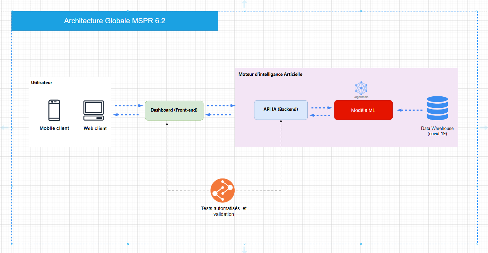

# Projet MSPR - Modèle Prédictif IA sur les Données COVID-19

## 📋 Cahier des Charges

**Bloc de Compétences E6.2**  
Développer un modèle prédictif d'une solution I.A.

**Objectifs :**

- Développement et déploiement d'une application respectant le cahier des charges Client.
- Développement applicatif utilisant une API IA.

## 🏆 Compétences Évaluées

- Générer, récolter et adapter les données d'entrée nécessaires au modèle d'apprentissage.
- Paramétrer un environnement de codage adéquat pour développer le modèle.
- Coder un modèle d’apprentissage choisi (réseau de neurones, boosting, forêt aléatoire, arbre de décision, etc.).
- Réaliser une procédure d’entraînement adaptée au modèle d’apprentissage sélectionné.
- Réaliser une phase de test pour évaluer les performances du modèle.
- Ajuster l’apprentissage du modèle en fonction des résultats obtenus.

## 📦 Livrables Attendus

1. Documentation détaillée :
    - Choix de l'algorithme utilisé.
    - Principes d'ergonomie et d'accessibilité de l'interface utilisateur.
    - Métriques de performance (précision, score, etc.).

2. Benchmark des solutions Front-end.

3. Application Front-end moderne, conforme aux besoins exprimés.

4. API IA développée en Python, avec justification des technologies utilisées.

5. Documentation API au format OpenAPI.

6. Tests automatisés et rapport de couverture des tests pour l'interface utilisateur.

7. Documentation relative à la conduite au changement (accessibilité).

## 🚀 Résultat Attendu

- Création d’un Front-End en cohérence avec les besoins exprimés.
- Modification de l’API existante.
- Entraînement d’une IA performante.
- Réalisation d’un tableau de bord de dataviz.

## ⚙️ Méthodologie

- Approche Agile avec feedback continu vers les commanditaires.
- Gestion de projet évolutive selon les besoins de l'OMS.

## ⏳ Phase 1 : Préparation

- **Durée de préparation :** 19 heures.
- **Travail en équipe :** 4 apprenants (5 maximum si groupe impair).

---

## 📌 Phases Clés du Projet

1. Préparation des données (ETL, nettoyage, formatage).
2. Modélisation et entraînement du modèle IA.
3. Développement de l’API IA.
4. Création du Front-End + tableau de bord de dataviz.
5. Tests & documentation.
6. Livraison et présentation aux parties prenantes.

---

## 🔗 Technologies Possibles

- **Backend / API IA:** [Python](https://www.python.org/) ([Flask](https://flask.palletsprojects.com/), [FastAPI](https://fastapi.tiangolo.com/))
- **Modèle IA:** [Scikit-learn](https://scikit-learn.org/stable/), [TensorFlow](https://www.tensorflow.org/), [PyTorch](https://pytorch.org/)
- **Frontend:** [React](https://reactjs.org/), [Vue.js](https://vuejs.org/), [Angular](https://angular.io/)
- **Tests:** [Pytest](https://docs.pytest.org/en/latest/), [Jest](https://jestjs.io/)
- **Dataviz:** [Plotly](https://plotly.com/python/), [Chart.js](https://www.chartjs.org/), [D3.js](https://d3js.org/)
- **Documentation API:** [Swagger / OpenAPI](https://swagger.io/tools/swagger-editor/)

---

## 👥 Équipe Projet

En cours....

---

## 📣 Communication

- Suivi de projet en méthode Agile.
- Reporting régulier vers les commanditaires.

---

## 🔄 Gestion des Évolutions

- Le projet évoluera selon les besoins et les retours de l'OMS.
- Les jalons et la planification seront mis à jour en continu.

---
