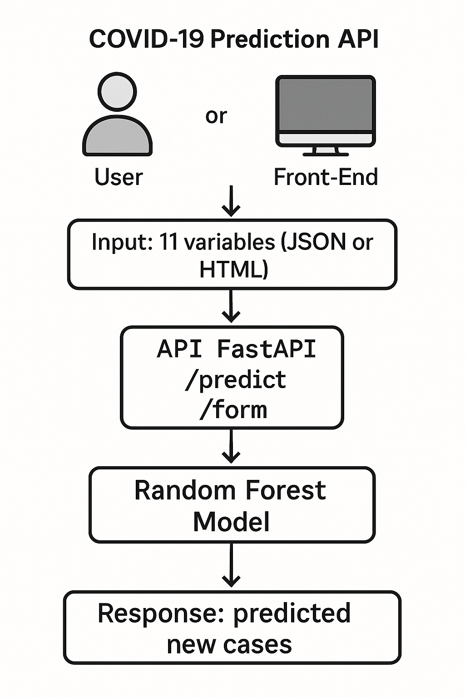

# API de Prédiction COVID-19 (a modifier)

## 1. Structure générale

L’API est construite avec **FastAPI**, un framework web rapide pour créer des services REST en Python.

Elle expose deux types d’accès :

- Un endpoint `/canada/new-cases` qui permet de faire des prédictions de nouveaux cas de COVID-19 en envoyant des données au format JSON.
- Un endpoint `/docs` qui fournit une documentation interactive de l’API, générée automatiquement

## 2. Chargement du modèle

Le modèle est chargé avec **joblib** :

```python
model = joblib.load("rf_model_canada.joblib")
```

Ce fichier `.joblib` contient le modèle **Random Forest** entraîné au préalable dans un notebook.

Ce modèle a été sauvegardé avec :

```python
joblib.dump(model, "rf_model_canada.joblib")
```

## 3. Schéma de données d’entrée

L’API attend un objet JSON contenant les **11 variables** utilisées lors de l’entraînement du modèle :

```json
{
  "new_cases_lag1": 500,
  "new_cases_lag7": 600,
  "new_cases_ma7": 550,
  "growth_rate": 1.05,
  "reproduction_rate": 1.1,
  "positive_rate": 0.15,
  "icu_patients": 50,
  "hosp_patients": 200,
  "stringency_index": 70.5,
  "vaccinated_rate": 65.0,
  "boosted_rate": 25.0
}
```



Ces variables sont typées et validées avec une classe **BaseModel** de **Pydantic** :

```python
class PredictionInput(BaseModel):
    new_cases_lag1: float
    new_cases_lag7: float
    new_cases_ma7: float
    growth_rate: float
    reproduction_rate: float
    positive_rate: float
    icu_patients: float
    hosp_patients: float
    stringency_index: float
    vaccinated_rate: float
    boosted_rate: float
```

## 4. Endpoint `/canada/new-cases` (POST)

Lorsqu’on envoie une requête **POST** à `/canada/new-cases`, voici ce qu’il se passe :

1. Les données JSON sont converties en objet Python (**PredictionInput**)
2. Ces valeurs sont transformées en tableau **NumPy** :

```python
features = np.array([[val1, val2, ..., val11]])
```

3. Le modèle effectue une prédiction :

```python
prediction = model.predict(features)[0]
```

4. L’API retourne un JSON avec la prédiction :

```json
{
  "predicted_new_cases": 752.43
}
```
